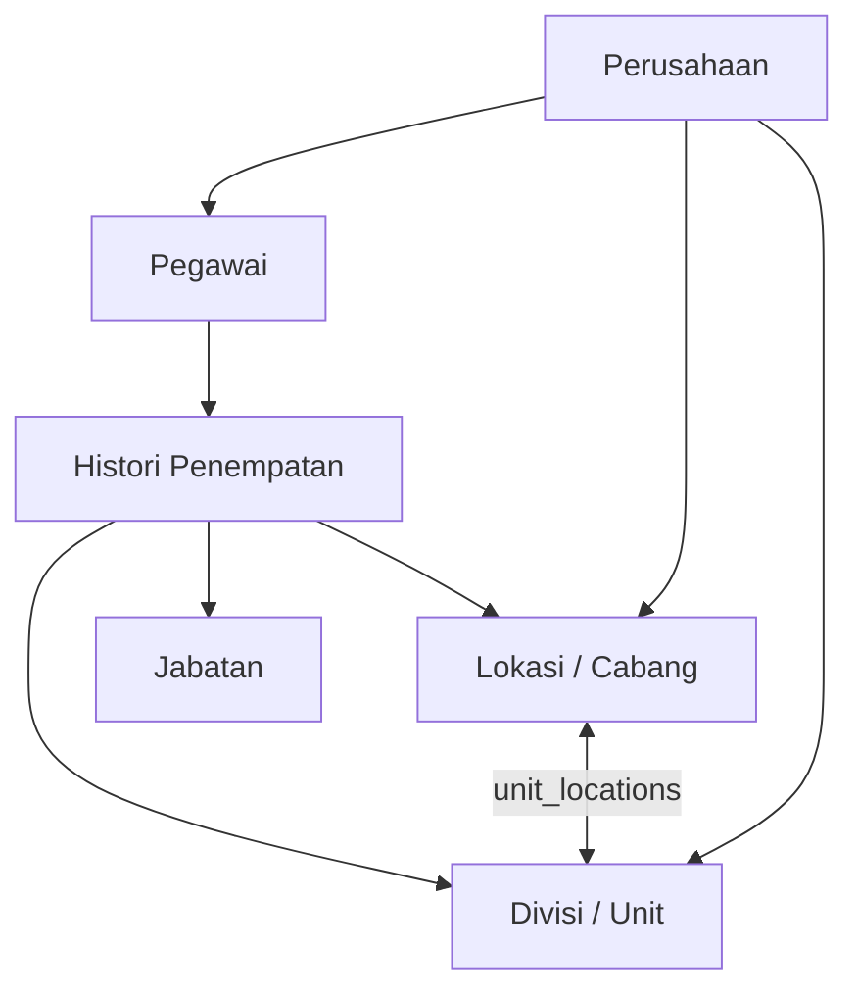
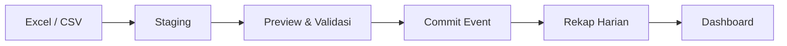

# Review dan Rancangan Database SITOU v3

## Kesimpulan

Rancangan sebelumnya mempunyai arah yang benar: satu PostgreSQL untuk banyak perusahaan, `organization_id`, histori penempatan, event dan rekap absensi terpisah, serta idempotensi mobile. Namun rancangan itu belum aman dijadikan fondasi jangka panjang tanpa revisi.

Skema v3 memperbaiki relasi cabang-divisi, tenant isolation, shift fleksibel, snapshot jadwal, geofence/foto, import massal, izin HRD-only, indikator disiplin, aturan SP tiga bulan, private file abstraction, index dashboard, partitioning event, audit, dan outbox integrasi.

## Temuan terhadap skema lama

| Temuan | Dampak | Perbaikan v3 |
|---|---|---|
| Tidak ada logo tenant yang terstruktur | Branding perusahaan berbeda tidak konsisten | `stored_files` + `organization_branding`; lokasi dapat memiliki logo sendiri |
| `org_units` dan `locations` berdiri sendiri | Tidak jelas divisi mana tersedia di cabang tertentu | `organization_unit_locations` many-to-many |
| FK transaksi hanya memakai ID | Record tenant A secara teori dapat menunjuk master tenant B | Composite FK `(organization_id,id)` pada relasi bisnis utama |
| Shift hanya memiliki start/end | Tidak cukup untuk pegawai fleksibel/lapangan dan roster | `work_shifts`, `shift_patterns`, `shift_pattern_days`, `shift_assignments` |
| Tidak ada snapshot jadwal harian | Perubahan master shift dapat mengubah interpretasi histori | `employee_daily_schedules` menyimpan jadwal aktual per tanggal |
| Checkout lewat jadwal langsung dianggap lembur | Pulang telat belum tentu lembur resmi | Pisahkan kandidat lembur dan lembur disetujui |
| Event menyimpan koordinat/foto tanpa kebijakan titik | Tidak dapat membuktikan radius atau penugasan titik pada saat event | `attendance_points`, assignment bertanggal, dan snapshot radius/jarak |
| Idempotensi mobile berada di tabel event | Sulit dijamin global ketika event dipartisi | `attendance_event_receipts` nonpartisi dengan unique client UUID |
| Tidak ada staging import | HRD harus input satu per satu atau import tanpa preview aman | Batch + row staging + validate + commit |
| Approval izin generik multistep | Berlawanan dengan keputusan bahwa approver hanya HRD | `leave_decisions` tunggal dengan guard role HRD |
| Tindakan disiplin langsung dari pegawai ke SP | Tidak memisahkan sinyal, pemeriksaan, dan keputusan | indikator → kasus → tindakan resmi |
| Seed SP berlaku 6 bulan | Bertentangan dengan Pasal 56 dan 57 | SP1/SP2/SP3 tepat 3 bulan |
| Index terbatas dan tidak tenant-first | Dashboard dan filter periode berpotensi scan besar | Composite/partial/trigram index sesuai query utama |
| `photo_path`/`file_key` terlalu terikat storage lokal | Migrasi ke object storage memengaruhi kode bisnis | Metadata file terpusat dan storage abstraction |

## Model organisasi



Satu cabang dapat mempunyai lebih dari satu divisi. Satu divisi juga dapat beroperasi di beberapa cabang. Pegawai tidak ditempel permanen pada salah satunya; periode rolling disimpan di `employee_assignments`.

## Best practice shift

Menempelkan shift langsung hanya ke pegawai tidak cukup karena administrasinya berat. Menempelkan shift hanya ke divisi juga tidak cukup karena selalu ada pengecualian. Gunakan inheritance dengan prioritas:

1. Shift khusus pegawai.
2. Shift divisi aktif pegawai.
3. Shift lokasi/cabang aktif pegawai.
4. Tanpa aturan: perlu ditinjau, bukan otomatis dianggap absen.

Pola mingguan atau roster menghasilkan jadwal harian. Rekap selalu membandingkan event dengan snapshot jadwal harian, sehingga perubahan jam kerja bulan depan tidak mengubah rekap bulan lalu.

Untuk shift fixed 09.00-17.00 dengan toleransi 10 menit:

- 09.00-09.10: tidak terlambat.
- 09.11: terlambat 1 menit setelah toleransi, atau 11 menit terhadap jadwal tergantung kebijakan laporan; skema menyimpan hasil final yang disepakati.
- Checkout sebelum batas toleransi pulang: pulang awal.
- Checkout setelah 17.00: kandidat lembur; baru menjadi lembur resmi jika kebijakan otomatis atau HRD menyetujui.

Untuk flexible/field, jangan memaksakan indikator terlambat bila tidak ada jam mulai target. Nilai durasi kerja, window capture, tugas, atau kebijakan lapangan.

## Absensi dashboard sebelum mobile

Solusi terbaik bukan input satu per satu dan bukan membuat database sementara. Gunakan API dan tabel yang sama sejak awal:



HRD mengunduh template, mengunggah file, memeriksa error per baris, lalu commit. Input manual tetap tersedia untuk koreksi kecil. Web kiosk/PWA dapat ditambahkan kemudian untuk capture kamera dan koordinat, tetapi memanggil endpoint event yang sama dengan aplikasi mobile.

Ketika mobile tersedia, perubahan hanya pada sumber event:

- import: `source='import'`;
- dashboard manual: `source='manual'`;
- web kiosk: `source='web_kiosk'`;
- mobile: `source='mobile'`.

Semua berakhir pada rekap yang sama. Tidak perlu database baru.

## Geofence dan foto

`attendance_points` menyimpan titik, radius, batas akurasi, kebutuhan foto, liveness, dan background reference. Aturan titik dapat ditempel pada pegawai, divisi, atau lokasi dengan periode berlaku. Ini memungkinkan superadmin/HRD memindahkan titik absensi tanpa kehilangan histori.

Saat capture, server menyimpan:

- koordinat dan akurasi perangkat;
- titik yang berlaku;
- jarak hasil hitung backend;
- radius snapshot;
- file foto privat;
- status geofence, foto/background, serta alasan review;
- `occurred_at`, `received_at`, timezone, dan status offline.

Jangan mempercayai jarak atau status “di dalam lokasi” yang dikirim aplikasi. Backend menghitung ulang. Foto bukan disimpan sebagai base64 atau URL publik; tabel hanya menyimpan referensi file privat.

## Rekap dan query dashboard

Event mentah tidak cocok dibaca langsung untuk setiap dashboard. Worker menghitung `attendance_daily_summaries`. Query dashboard kemudian murah:

```sql
SELECT attendance_status, count(*)
FROM attendance_daily_summaries
WHERE organization_id = $1
  AND work_date = $2
GROUP BY attendance_status;
```

Daftar pegawai sering terlambat 30 hari:

```sql
SELECT employee_id,
       count(*) AS late_days,
       sum(late_minutes) AS total_late_minutes
FROM attendance_daily_summaries
WHERE organization_id = $1
  AND work_date >= $2
  AND work_date < $3
  AND late_minutes > 0
GROUP BY employee_id
ORDER BY late_days DESC, total_late_minutes DESC
LIMIT $4;
```

Index `organization_id, work_date, attendance_status` dan `organization_id, employee_id, work_date DESC` mendukung pola tersebut. Pastikan query selalu mempunyai tenant dan rentang tanggal.

## Aturan disiplin dari dokumen

Dokumen yang dilampirkan menetapkan:

- Ringan: mangkir 1 hari; terlambat/pulang awal tanpa izin; tidak mencatat absensi; dan pelanggaran ringan lainnya.
- Sedang: mangkir 3 hari kerja berturut-turut; mengulangi pelanggaran ringan dalam masa SP; dan daftar Pasal 57.
- Berat: mangkir 5 hari kerja berturut-turut atau lebih; mangkir 9 hari dalam 1 bulan; dan daftar Pasal 58.
- Ringan bertahap dari teguran lisan, SP1, SP2, SP3 bila tidak membaik/mengulang.
- Sedang dapat SP1-SP3 dan dalam keadaan tertentu langsung SP2/SP3 dengan pertimbangan tingkat kesalahan dan dampak.
- Berat dapat SP3, skorsing, penurunan jabatan, dan/atau PHK sesuai proses resmi.
- SP1, SP2, dan SP3 berlaku masing-masing 3 bulan.

Karena klasifikasi memerlukan konteks, sistem hanya menghasilkan indikator. HRD meninjau bukti, membuka kasus, memberi kesempatan penjelasan bila berlaku, mengunggah surat, dan mencatat tindakan. Dashboard pimpinan boleh menunjukkan status dan histori sesuai permission, tetapi tidak menerbitkan sanksi.

## Indexing dan kapasitas

400 pegawai per perusahaan masih kecil untuk PostgreSQL. Bahkan puluhan juta event dapat ditangani bila query, index, koneksi, dan maintenance benar. Fokus operasional:

- connection pooling/PgBouncer;
- composite index tenant-first;
- event dipartisi bulanan, bukan per tenant;
- rekap untuk dashboard;
- pagination;
- export/background job;
- autovacuum dan statistik;
- `pg_stat_statements` dan slow-query review;
- `EXPLAIN (ANALYZE, BUFFERS)` dengan data representatif.

Jangan membuat index untuk setiap kolom. Index mempercepat baca tetapi menambah biaya insert dan storage.

## Catatan penerapan skema

1. Skema adalah target untuk database baru. Jika database lama sudah berisi data, pecah menjadi migration expand-backfill-contract.
2. Seed aturan tenant baru harus dilakukan service onboarding; seed SQL yang memakai `SELECT FROM organizations` hanya mencakup tenant yang sudah ada saat migration.
3. Buat partisi bulan berjalan dan dua bulan berikutnya sebelum menerima event.
4. Constraint satu penempatan utama aktif mencegah dua current assignment. Service tetap harus memvalidasi histori periode agar tidak overlap.
5. Tabel `attendance_events_default` hanya pengaman; monitor agar tidak menjadi tempat penumpukan permanen.
6. Tambahkan Row Level Security setelah pola koneksi aplikasi ditetapkan dan diuji. Filter tenant pada service tetap wajib.
7. Untuk geospatial query yang lebih kompleks, PostGIS dapat ditambahkan tanpa mengubah kontrak tabel bisnis; untuk satu titik radius, perhitungan jarak backend sudah memadai.

## Tahapan implementasi

### Fase 1 - dashboard data pegawai

- Tenant, branding, lokasi, divisi, jabatan, user/role.
- Profil lengkap pegawai dan file privat.
- Kontrak dan histori penempatan/rolling.
- Dashboard HRD dan pimpinan.
- Audit dan export dasar.

### Fase 2 - absensi dashboard

- Master shift/pola/assignment dan generator jadwal.
- Import Excel/CSV dengan staging.
- Rekap harian, filter, koreksi, dan indikator.
- Input izin/sakit oleh HRD beserta lampiran.

### Fase 3 - disiplin

- Indikator dari rekap.
- Review HRD, kasus, penjelasan, upload surat, dan tindakan.
- Tampilan pimpinan read-only sesuai permission.

### Fase 4 - mobile/web capture

- Event API idempotent.
- Geofence, kamera, offline sync, dan private upload.
- Pengajuan izin/cuti karyawan; keputusan tetap HRD.
- Monitoring perangkat, fraud signal, dan retention foto.

Tahapan ini menjaga dashboard dapat dipakai lebih cepat tanpa membuang desain yang diperlukan aplikasi mobile.
